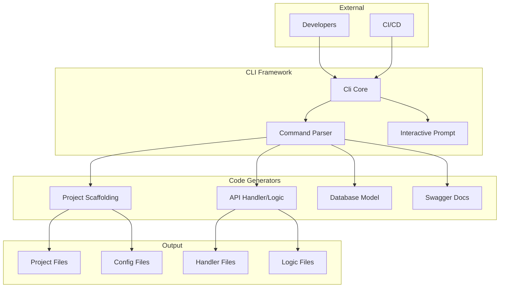

# Faultless Framework Architecture - v10.0.0 (2024)

## Overview

This document describes the architecture of Faultless v10.0.0, focusing on Code Generation CLI (goctl equivalent).

## Version Timeline

| Version | Year | Focus |
|---------|------|-------|
| v1.0.0 | 2015 | Core HTTP Server |
| v2.0.0 | 2016 | Config + Logging Enhancements |
| v3.0.0 | 2017 | Middleware + Error Handling |
| v4.0.0 | 2018 | Service Discovery + Load Balancing |
| v5.0.0 | 2019 | Advanced Resilience Patterns |
| v6.0.0 | 2020 | RPC Framework + Protobuf |
| v7.0.0 | 2021 | Caching + Database Integration |
| v8.0.0 | 2022 | Distributed Tracing + Metrics |
| v9.0.0 | 2023 | API Gateway |
| **v10.0.0** | **2024** | **Code Generation CLI** |
| v11.0.0 | 2025 | Microservice Governance |
| v12.0.0 | 2026 | Full Feature Parity |

## v10.0.0 Architecture



## New Features in v10.0.0

### CLI Core

```typescript
const cli = new Cli('10.0.0');

// Register commands
cli.command('init', 'Initialize a new project', [
  { name: 'name', description: 'Project name', type: 'string', required: true },
  { name: 'type', description: 'Project type', type: 'string', default: 'monolith' },
], async (args, options) => {
  await generateProject({ ... }, options.dir);
});

// Run CLI
await cli.run();
```

**Commands:**
| Command | Description | Options |
|---------|-------------|---------|
| `init` | Initialize new project | name, type, dir |
| `api` | Generate API handler/logic | file, output |
| `model` | Generate model from DB | table, db |
| `swagger` | Generate Swagger docs | file, output |
| `docker` | Generate Docker files | name, port |

### Project Scaffolding

```typescript
await generateProject({
  name: 'my-app',
  description: 'My application',
  author: 'John Doe',
  version: '1.0.0',
  type: 'monolith',
  features: ['config', 'logging', 'auth'],
}, './my-app');
```

**Generated Structure:**
```
my-app/
├── src/
│   └── index.ts
├── etc/
│   └── app.yaml
├── internal/
│   ├── config/
│   ├── handler/
│   ├── logic/
│   ├── svc/
│   └── types/
├── package.json
└── tsconfig.json
```

### API Definition Parser

**Input (.api file):**
```api
info(
  title = "User API"
  description = "User management API"
  version = "1.0.0"
  author = "John Doe"
)

types(
  User {
    id string
    name string
    email string optional
  }

  CreateUserRequest {
    name string
    email string
  }

  CreateUserResponse {
    id string
    message string
  }
)

routes(
  GET /users User ListUsersHandler
  POST /users CreateUserRequest CreateUserResponse CreateUserHandler
)
```

**Output:**
```typescript
// handlers.ts
import { Injectable } from '@Faultless/core';
import { Get, Post, Body } from '@Faultless/http';

@Injectable()
export class ListUsersHandler {
  @Get('/users')
  async handle() {
    // TODO: Implement handler logic
    return { message: 'ListUsersHandler called' };
  }
}

@Injectable()
export class CreateUserHandler {
  @Post('/users')
  async handle(@Body() body: CreateUserRequest) {
    // TODO: Implement handler logic
    return { message: 'CreateUserHandler called' };
  }
}
```

### Interactive Prompts

```typescript
// Prompt for input
const name = await prompt('Project name');
const type = await prompt('Project type', 'monolith');

// Confirm action
const confirmed = await confirm('Proceed with generation?', true);
```

## Package Structure

### @Faultless/cli v10.0.0

| Module | Description |
|--------|-------------|
| `cli.ts` | CLI core with command registration, argument parsing, interactive prompts |
| `project.ts` | Project scaffolding with directory structure and config files |
| `api.ts` | API definition parser, handler/logic generator |

## Configuration Schema

**CLI Config (package.json):**
```json
{
  "name": "my-project",
  "version": "1.0.0",
  "scripts": {
    "dev": "tsx watch src/index.ts",
    "build": "tsc",
    "start": "node dist/index.js",
    "test": "vitest run"
  }
}
```

**Project Config (etc/app.yaml):**
```yaml
name: my-project
host: 0.0.0.0
port: 8888
maxConnections: 10000
timeout: 30000

log:
  mode: console
  level: info
```

## Running the Example

```bash
cd examples/v10-cli
pnpm install
pnpm dev init --name my-app --type monolith
pnpm dev api --file greet.api --output ./internal
```

## Testing

```bash
pnpm test
```

## Design Decisions

1. **Command-based CLI** - Extensible command registration
2. **Interactive Prompts** - User-friendly input collection
3. **Template-based Generation** - Consistent code output
4. **API Definition Language** - Custom DSL for route definition
5. **TypeScript First** - Type-safe generated code

## Integration with Previous Versions

```bash
# Generate project with all features
Faultless init --name my-service --type monolith
cd my-service

# Add API routes
Faultless api --file user.api --output ./internal

# Generate models from database
Faultless model --table users --db postgres://localhost:5432/mydb

# Generate Swagger docs
Faultless swagger --file user.api --output ./docs

# Generate Docker files
Faultless docker --name my-service --port 8888
```

## Next Steps (v11.0.0)

- Microservice Governance
- Circuit Breaker Dashboard
- Rate Limiting Dashboard
- Health Check Dashboard