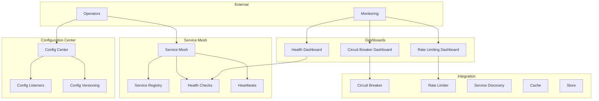

# Faultless Framework Architecture - v11.0.0 (2025)

## Overview

This document describes the architecture of Faultless v11.0.0, focusing on Microservice Governance.

## Version Timeline

| Version | Year | Focus |
|---------|------|-------|
| v1.0.0 | 2015 | Core HTTP Server |
| v2.0.0 | 2016 | Config + Logging Enhancements |
| v3.0.0 | 2017 | Middleware + Error Handling |
| v4.0.0 | 2018 | Service Discovery + Load Balancing |
| v5.0.0 | 2019 | Advanced Resilience Patterns |
| v6.0.0 | 2020 | RPC Framework + Protobuf |
| v7.0.0 | 2021 | Caching + Database Integration |
| v8.0.0 | 2022 | Distributed Tracing + Metrics |
| v9.0.0 | 2023 | API Gateway |
| v10.0.0 | 2024 | Code Generation CLI |
| **v11.0.0** | **2025** | **Microservice Governance** |
| v12.0.0 | 2026 | Full Feature Parity |

## v11.0.0 Architecture



## New Features in v11.0.0

### Service Mesh

```typescript
const mesh = createServiceMesh({
  enabled: true,
  sidecarEnabled: true,
  mutualTlsEnabled: true,
  rateLimitingEnabled: true,
  circuitBreakerEnabled: true,
  loadBalancingStrategy: 'p2c',
});

// Register service
mesh.registerService({
  id: 'user-service-1',
  name: 'user-service',
  host: '127.0.0.1',
  port: 3001,
  protocol: 'http',
  version: '1.0.0',
  metadata: { region: 'us-east-1', zone: 'us-east-1a' },
  status: 'UP',
  registeredAt: new Date(),
  lastHeartbeat: new Date(),
  healthCheck: {
    path: '/health',
    intervalMs: 10000,
  },
});

// Get healthy services
const healthy = mesh.getHealthyServices('user-service');

// Send heartbeat
mesh.heartbeat('user-service-1');
```

### Config Center

```typescript
const configCenter = createConfigCenter();

// Set config
configCenter.set('user-service.maxConnections', 1000);
configCenter.set('user-service.timeout', 30000);

// Get config
const maxConnections = configCenter.get('user-service.maxConnections', 500);

// Add listener
configCenter.addListener('user-service.maxConnections', (value) => {
  console.log('Config changed:', value);
});

// Get all config
const allConfig = configCenter.getAll();
```

### Service Instance Model

```typescript
interface ServiceInstance {
  id: string;
  name: string;
  host: string;
  port: number;
  protocol: string;
  version: string;
  metadata: Record<string, string>;
  status: 'UP' | 'DOWN' | 'MAINTENANCE';
  registeredAt: Date;
  lastHeartbeat: Date;
  healthCheck?: {
    path: string;
    intervalMs: number;
  };
}
```

## Package Structure

### @Faultless/governance v11.0.0

| Module | Description |
|--------|-------------|
| `service-mesh.ts` | Service mesh with registration, health checks, heartbeats |
| `config-center.ts` | Configuration management with listeners |

## Configuration Schema

**Service Mesh Config:**
```json
{
  "governance": {
    "serviceMesh": {
      "enabled": true,
      "sidecarEnabled": true,
      "mutualTlsEnabled": true,
      "rateLimitingEnabled": true,
      "circuitBreakerEnabled": true,
      "loadBalancingStrategy": "p2c"
    }
  }
}
```

**Config Center Config:**
```json
{
  "governance": {
    "configCenter": {
      "type": "etcd",
      "endpoints": ["localhost:2379"],
      "prefix": "/Faultless/config"
    }
  }
}
```

## Running the Example

```bash
cd examples/v11-governance
pnpm install
pnpm dev
```

Test endpoints:
- `GET /governance/mesh/stats` - Get mesh statistics
- `GET /governance/mesh/config` - Get mesh configuration
- `GET /governance/mesh/services` - List all services
- `GET /governance/mesh/services/:name` - Get services by name
- `GET /governance/mesh/healthy` - Get healthy services
- `POST /governance/mesh/services/:id/heartbeat` - Send heartbeat
- `POST /governance/mesh/services/:id/status` - Update service status
- `GET /governance/config` - Get all config
- `GET /governance/config/:key` - Get config by key
- `POST /governance/config/:key` - Set config
- `GET /governance/config/stats` - Get config stats

## Testing

```bash
pnpm test
```

## Design Decisions

1. **Service Mesh Architecture** - Sidecar-based proxy pattern
2. **Health Check Integration** - Automatic service health monitoring
3. **Config Center with Listeners** - Real-time config updates
4. **Metadata Support** - Flexible service metadata for routing/filtering
5. **Mutual TLS Ready** - Built-in encryption support

## Integration with Previous Versions

```typescript
// Full stack with governance
const app = createApplication({
  modules: [AppModule],
  serverOptions: {
    port: 3000,
    middleware: [
      createTracingMiddleware(tracing),
      createMetricsMiddleware(metrics),
      createGatewayMiddleware(gateway),
      createResponseTransformerMiddleware(gateway),
    ],
  },
});
```

## Next Steps (v12.0.0)

- Full Feature Parity
- Complete API compatibility
- Performance optimization
- Enterprise features