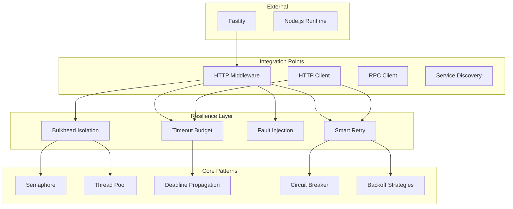

# Faultless Framework Architecture - v5.0.0 (2019)

## Overview

This document describes the architecture of Faultless v5.0.0, focusing on advanced resilience patterns, inspired by modern microservice architecture's resilience mechanisms.

## Version Timeline

| Version | Year | Focus |
|---------|------|-------|
| v1.0.0 | 2015 | Core HTTP Server |
| v2.0.0 | 2016 | Config + Logging Enhancements |
| v3.0.0 | 2017 | Middleware + Error Handling |
| v4.0.0 | 2018 | Service Discovery + Load Balancing |
| **v5.0.0** | **2019** | **Advanced Resilience Patterns** |
| v6.0.0 | 2020 | RPC Framework + Protobuf |
| v7.0.0 | 2021 | Caching + Database Integration |
| v8.0.0 | 2022 | Distributed Tracing + Metrics |
| v9.0.0 | 2023 | API Gateway |
| v10.0.0 | 2024 | Code Generation CLI |
| v11.0.0 | 2025 | Microservice Governance |
| v12.0.0 | 2026 | Full Feature Parity |

## v5.0.0 Architecture



## New Features in v5.0.0

### Bulkhead Isolation (`bulkhead.ts`)

Two isolation modes:

#### 1. Semaphore-based (Simple Concurrency Limit)
```typescript
const bulkhead = createBulkhead({
  name: 'payment-service',
  maxConcurrent: 10,    // Max concurrent executions
  maxQueued: 5,         // Max queued waiting
  timeoutMs: 30000,     // Execution timeout
  queueTimeoutMs: 5000, // Queue wait timeout
  degradationThreshold: 80, // % to trigger degraded state
});

await bulkhead.execute(async () => {
  // This code runs within the bulkhead
  return await processPayment(amount);
});
```

**States:**
- `CLOSED` - Normal operation
- `DEGRADED` - High load, approaching limit
- `OPEN` - Full capacity, rejecting requests

#### 2. ThreadPool-based (Advanced Isolation)
```typescript
// For CPU-intensive tasks
const threadBulkhead = createBulkhead({
  name: 'image-processing',
  maxConcurrent: 4,
  maxQueued: 100,
  timeoutMs: 60000,
});
```

**Features:**
- Event-driven state transitions
- Queue timeout with configurable wait
- Metrics tracking (executions, rejections, timeouts)
- Registry for managing multiple bulkheads

### Timeout Budget & Deadline Propagation (`timeout-budget.ts`)

```typescript
// Create deadline at entry point
const deadline = Deadline.fromHeaders(request.headers, 5000);

// Propagate to downstream
const downstreamHeaders = deadline.toHeaders();
// Sends: x-Faultless-deadline, x-Faultless-deadline-id, x-Faultless-deadline-remaining

// Receive at downstream
const receivedDeadline = Deadline.fromHeaders(request.headers, 30000);

// Create derived deadline with buffer
const derivedDeadline = receivedDeadline.createDownstream({
  bufferMs: 100, // 100ms buffer for processing
});
```

**Header Format:**
```
x-Faultless-deadline: 5000
x-Faultless-deadline-id: deadline-1234567890-abc123
x-Faultless-deadline-remaining: 4500
x-Faultless-deadline-source: CLIENT
x-Faultless-deadline-cascade: 0
```

**Timeout Budget:**
```typescript
const budget = createTimeoutBudget();
const d1 = budget.create({ timeoutMs: 5000 });
const d2 = budget.create({ timeoutMs: 3000 });

// Check remaining budget
console.log(budget.getRemainingBudget()); // 3000 (min of all deadlines)
```

### Fault Injection Engine (`fault-injection.ts`)

Chaos engineering support for testing:

```typescript
const engine = createFaultInjectionEngine();

// Register faults
engine.register('latency-test', {
  type: FaultType.LATENCY,
  condition: { path: '^/api/', percentage: 10 },
  config: { latencyMs: 500 },
});

engine.register('error-test', {
  type: FaultType.ERROR,
  condition: { method: 'POST' },
  config: { statusCode: 500, errorMessage: 'Injected error' },
});

// Use predefined scenarios
engine.register('chaos', FaultScenarios.timeout30Percent());
```

**Fault Types:**
| Type | Description | Use Case |
|------|-------------|----------|
| `LATENCY` | Artificial delay | Test timeout handling |
| `ERROR` | Custom error response | Test error handling |
| `TIMEOUT` | Force timeout | Test timeout recovery |
| `PARTIAL_RESPONSE` | Partial data | Test partial failure |
| `DROP_CONNECTION` | Drop connection | Test connection recovery |
| `REJECT` | Reject with status | Test rejection handling |
| `CORRUPT` | Corrupt response | Test data validation |

**Predefined Scenarios:**
- `latency500ms()` - 500ms delay
- `errorOnApi()` - 500 on /api/*
- `timeout30Percent()` - 30% timeout
- `rejectPost()` - Reject all POST
- `corrupt10Percent()` - Corrupt 10% responses
- `partialUsers()` - Partial /users response

### Smart Retry Engine (`smart-retry.ts`)

Enhanced retry with circuit breaker awareness:

```typescript
const retryEngine = createSmartRetryEngine({
  strategy: RetryStrategy.EXPONENTIAL,
  maxRetries: 3,
  initialDelayMs: 100,
  maxDelayMs: 5000,
  jitterMs: 0.5,
  circuitBreakerAware: true,
});

// Per-endpoint retry policy
retryEngine.registerEndpoint({
  path: '/api/critical',
  policy: {
    strategy: RetryStrategy.FIXED,
    maxRetries: 5,
    initialDelayMs: 10,
  },
});

// Execute with retry
const result = await retryEngine.execute(
  async () => await apiCall(),
  {
    path: '/api/data',
    method: 'GET',
    circuitBreaker: myCircuitBreaker,
    deadline: myDeadline,
  }
);
```

**Backoff Strategies:**
| Strategy | Formula | Use Case |
|----------|---------|----------|
| `FIXED` | `delay` | Constant delay |
| `EXPONENTIAL` | `delay * 2^attempt` | General purpose |
| `LINEAR` | `delay * (attempt + 1)` | Gradual increase |
| `FIBONACCI` | `fib(attempt + 2) * delay` | Smooth increase |
| `DECORRELATED` | `random * maxDelay` | Full jitter |

**Features:**
- Circuit breaker aware (stops retrying when open)
- Respects `Retry-After` header
- Configurable retryable errors/statuses
- Deadline-aware (stops if deadline expired)
- Detailed retry history

### Resilience Middleware (`middleware.ts`)

Unified middleware combining all patterns:

```typescript
import { createResilienceMiddleware } from '@Faultless/resilience';

const resilience = createResilienceMiddleware({
  bulkhead: {
    enabled: true,
    maxConcurrent: 100,
    maxQueued: 50,
  },
  timeoutBudget: {
    enabled: true,
    defaultTimeoutMs: 30000,
    propagateHeaders: true,
  },
  faultInjection: {
    enabled: process.env.NODE_ENV === 'test',
    faults: [
      { id: 'chaos', type: 'LATENCY', config: { latencyMs: 100 } },
    ],
  },
  retry: {
    enabled: true,
    maxRetries: 3,
    strategy: RetryStrategy.EXPONENTIAL,
  },
});

// Apply to Fastify
fastify.addHook('preHandler', resilience);
```

## Package Structure

### @Faultless/resilience v5.0.0

| Module | Description |
|--------|-------------|
| `bulkhead.ts` | Bulkhead isolation (semaphore/ThreadPool) |
| `timeout-budget.ts` | Deadline propagation + Timeout Budget |
| `fault-injection.ts` | Chaos engineering fault injection |
| `smart-retry.ts` | Circuit breaker-aware retry engine |
| `middleware.ts` | Unified resilience middleware |

## Configuration Schema

```json
{
  "resilience": {
    "bulkhead": {
      "enabled": true,
      "maxConcurrent": 100,
      "maxQueued": 50,
      "timeoutMs": 30000,
      "queueTimeoutMs": 5000,
      "degradationThreshold": 80
    },
    "timeoutBudget": {
      "enabled": true,
      "defaultTimeoutMs": 30000,
      "propagateHeaders": true,
      "cascadeBufferMs": 100
    },
    "faultInjection": {
      "enabled": false,
      "faults": []
    },
    "retry": {
      "enabled": true,
      "maxRetries": 3,
      "strategy": "expontential",
      "initialDelayMs": 100,
      "maxDelayMs": 5000,
      "jitterMs": 0.5,
      "circuitBreakerAware": true,
      "retryableErrors": ["ECONNRESET", "ECONNREFUSED"],
      "retryableStatuses": [408, 429, 500, 502, 503, 504]
    }
  }
}
```

## Running the Example

```bash
cd examples/v5-resilience
pnpm install
pnpm dev
```

Test endpoints:
- `POST /payment/process` - Process payment (bulkhead isolated)
- `GET /payment/status` - Get bulkhead state
- `POST /orders` - Create order with retry
- `GET /faults/stats` - Get fault injection stats
- `POST /faults/register` - Register new fault
- `GET /resilience/bulkheads` - Get all bulkhead states
- `GET /resilience/health` - Resilience health check
- `GET /timeout/demo` - Timeout budget demo

## Testing

```bash
pnpm test
```

## Design Decisions

1. **Bulkhead as Primary Isolation** - Prevents cascade failures by limiting concurrent access
2. **Deadline Propagation** - Ensures timeouts cascade through call chain
3. **Fault Injection for Testing** - Enables chaos engineering in development/test
4. **Circuit Breaker Integration** - Smart retry respects circuit state
5. **Jitter in Retry** - Prevents thundering herd
6. **Per-Endpoint Policies** - Different endpoints have different retry needs

## Integration with v4.0.0

```typescript
// Combine with discovery and load balancing
const app = createApplication({
  modules: [AppModule],
  serverOptions: {
    port: 3000,
  },
  resilience: {
    bulkhead: { maxConcurrent: 100 },
    retry: { maxRetries: 3, circuitBreakerAware: true },
  },
});
```

## Next Steps (v6.0.0)

- RPC Framework (gRPC/Protobuf support)
- Service-to-service authentication
- Connection pooling
- Load balancing for RPC