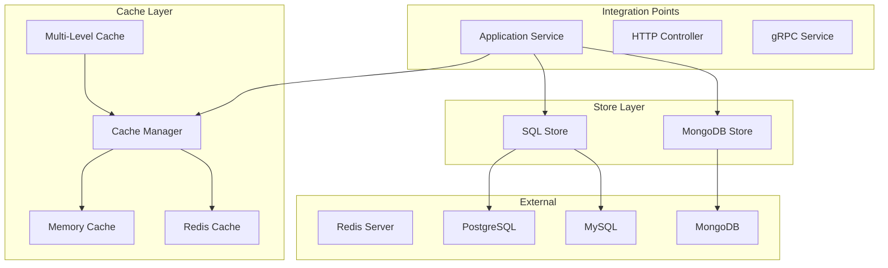

# Faultless Framework Architecture - v7.0.0 (2021)

## Overview

This document describes the architecture of Faultless v7.0.0, focusing on caching and database integration, inspired by modern microservice architecture's stores.

## Version Timeline

| Version | Year | Focus |
|---------|------|-------|
| v1.0.0 | 2015 | Core HTTP Server |
| v2.0.0 | 2016 | Config + Logging Enhancements |
| v3.0.0 | 2017 | Middleware + Error Handling |
| v4.0.0 | 2018 | Service Discovery + Load Balancing |
| v5.0.0 | 2019 | Advanced Resilience Patterns |
| v6.0.0 | 2020 | RPC Framework + Protobuf |
| **v7.0.0** | **2021** | **Caching + Database Integration** |
| v8.0.0 | 2022 | Distributed Tracing + Metrics |
| v9.0.0 | 2023 | API Gateway |
| v10.0.0 | 2024 | Code Generation CLI |
| v11.0.0 | 2025 | Microservice Governance |
| v12.0.0 | 2026 | Full Feature Parity |

## v7.0.0 Architecture



## New Features in v7.0.0

### Cache Manager (`cache-manager.ts`)

```typescript
const cache = createCacheManager({
  provider: CacheProvider.MEMORY,
  ttl: 60000,           // 1 minute default
  prefix: 'myapp:',
  serialize: true,       // JSON serialization
  max: 1000,            // Max entries for memory
});

// Basic operations
await cache.set('user:1', { id: '1', name: 'John' });
const user = await cache.get('user:1');
await cache.delete('user:1');
await cache.has('user:1');

// Get or set (cache-aside)
const data = await cache.getOrSet('key', async () => {
  return await fetchDataFromDB();
}, 60000);

// Batch operations
await cache.mset([
  { key: 'user:1', value: user1 },
  { key: 'user:2', value: user2 },
]);
const users = await cache.mget(['user:1', 'user:2']);
await cache.mdel(['user:1', 'user:2']);
```

**Features:**
- Memory cache with LRU eviction
- TTL support
- JSON serialization
- Key prefix support
- Batch operations (mget, mset, mdel)
- Cache-aside pattern (getOrSet)
- Statistics tracking (hits, misses, evictions)

### Redis Cache (`redis-cache.ts`)

```typescript
const redisCache = createRedisCache({
  host: 'localhost',
  port: 6379,
  password: 'secret',
  db: 0,
  keyPrefix: 'myapp:',
  ttl: 60000,
});

await redisCache.connect();

// Same API as memory cache
await redisCache.set('user:1', user);
const user = await redisCache.get('user:1');

// Pipeline support
await redisCache.mset([
  { key: 'user:1', value: user1 },
  { key: 'user:2', value: user2 },
]);
```

**Features:**
- Connection pooling
- Pipeline support
- Key prefix
- TTL support
- Sentinel support for HA

### Multi-Level Cache

```typescript
const cache = createMultiLevelCache({
  l1: {
    provider: CacheProvider.MEMORY,
    ttl: 30000,
    prefix: 'l1:',
    max: 100,
  },
  l2: {
    provider: CacheProvider.REDIS,
    ttl: 60000,
    prefix: 'l2:',
    redis: { host: 'localhost', port: 6379 },
  },
});

// Automatically uses L1 first, then L2
const data = await cache.get('key');
await cache.set('key', value);
```

**Features:**
- L1: Fast memory cache
- L2: Distributed Redis cache
- Automatic L1 population from L2
- Configurable TTL per level

### SQL Store (`sql-store.ts`)

```typescript
const store = createSqlStore({
  type: SqlDatabaseType.POSTGRESQL,
  host: 'localhost',
  port: 5432,
  database: 'mydb',
  username: 'user',
  password: 'pass',
  maxConnections: 10,
});

await store.connect();

// Query
const result = await store.query<User>('SELECT * FROM users WHERE id = $1', [1]);
const user = await store.queryOne<User>('SELECT * FROM users WHERE id = $1', [1]);

// Insert
const newUser = await store.insert<User>(
  'INSERT INTO users (name, email) VALUES ($1, $2) RETURNING *',
  ['John', 'john@example.com']
);

// Update/Delete
const affected = await store.execute('UPDATE users SET name = $1 WHERE id = $2', ['Jane', 1]);

// Transaction
await store.transaction(async (trx) => {
  await trx.query('UPDATE accounts SET balance = balance - $1 WHERE id = $2', [100, 1]);
  await trx.query('UPDATE accounts SET balance = balance + $1 WHERE id = $2', [100, 2]);
});
```

**Features:**
- PostgreSQL and MySQL support
- Connection pooling
- Transaction support
- Prepared statements
- Query result mapping

### MongoDB Store (`mongo-store.ts`)

```typescript
const mongo = createMongoStore({
  uri: 'mongodb://localhost:27017',
  database: 'mydb',
  maxPoolSize: 10,
});

await mongo.connect();

// CRUD operations
const user = await mongo.findOne('users', { _id: '1' });
const users = await mongo.find('users', { active: true }, { limit: 10 });
const newUser = await mongo.insertOne('users', { name: 'John' });
await mongo.updateOne('users', { _id: '1' }, { $set: { name: 'Jane' } });
await mongo.deleteOne('users', { _id: '1' });

// Aggregation
const result = await mongo.aggregate('users', [
  { $match: { active: true } },
  { $group: { _id: '$department', count: { $sum: 1 } } },
]);

// Bulk operations
await mongo.bulkWrite('users', [
  { insertOne: { document: { name: 'User1' } } },
  { updateOne: { filter: { _id: '1' }, update: { $set: { active: true } } } },
]);
```

**Features:**
- Connection pooling
- CRUD operations
- Aggregation pipeline
- Bulk operations
- Index management

### Decorators

```typescript
// Cache decorator
@Injectable()
class UserService {
  @Cached({ key: 'user', ttl: 60000 })
  async findById(id: string) {
    return await this.db.query('SELECT * FROM users WHERE id = $1', [id]);
  }

  @CacheInvalidate('user:*')
  async updateUser(id: string, data: any) {
    await this.db.query('UPDATE users SET ... WHERE id = $1', [id]);
  }
}
```

## Package Structure

### @Faultless/cache v7.0.0

| Module | Description |
|--------|-------------|
| `cache-manager.ts` | In-memory cache with LRU, TTL, serialization |
| `redis-cache.ts` | Redis cache with connection pooling |

### @Faultless/store v7.0.0

| Module | Description |
|--------|-------------|
| `sql-store.ts` | PostgreSQL/MySQL with transactions |
| `mongo-store.ts` | MongoDB with aggregation, bulk ops |

## Configuration Schema

```json
{
  "cache": {
    "provider": "MEMORY",
    "ttl": 60000,
    "prefix": "Faultless:",
    "max": 1000,
    "redis": {
      "host": "localhost",
      "port": 6379,
      "password": "",
      "db": 0
    }
  },
  "store": {
    "sql": {
      "type": "POSTGRESQL",
      "host": "localhost",
      "port": 5432,
      "database": "mydb",
      "username": "user",
      "password": "pass",
      "maxConnections": 10
    },
    "mongo": {
      "uri": "mongodb://localhost:27017",
      "database": "mydb",
      "maxPoolSize": 10
    }
  }
}
```

## Running the Example

```bash
cd examples/v7-cache-store
pnpm install
pnpm dev
```

Test endpoints:
- `GET /users` - List users (cached)
- `GET /users/:id` - Get user (cached)
- `POST /users` - Create user (invalidates cache)
- `POST /users/:id/invalidate` - Invalidate user cache
- `GET /users/cache/stats` - Cache statistics
- `GET /products/:id` - Get product (multi-level cache)
- `GET /products/cache/stats` - Multi-level cache stats

## Testing

```bash
pnpm test
```

## Design Decisions

1. **Cache-Aside Pattern** - Application manages cache explicitly
2. **Multi-Level Caching** - L1 for speed, L2 for distribution
3. **JSON Serialization** - Simple, human-readable
4. **Decorator Support** - Clean API for caching methods
5. **Connection Pooling** - Reuse database connections
6. **Transaction Support** - ACID compliance

## Integration with Previous Versions

```typescript
// Combine with HTTP, discovery, resilience
const app = createApplication({
  modules: [AppModule],
  serverOptions: { port: 3000 },
  cache: { provider: 'MEMORY', ttl: 60000 },
  store: {
    sql: { type: 'POSTGRESQL', host: 'localhost', database: 'mydb' },
  },
});
```

## Next Steps (v8.0.0)

- Distributed Tracing (OpenTelemetry)
- Metrics (Prometheus, StatsD)
- Logging integration
- Health checks with store