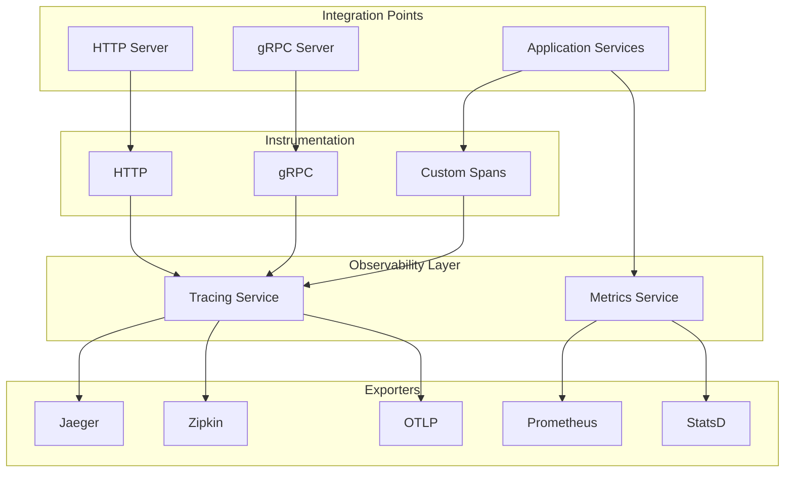

# Faultless Framework Architecture - v8.0.0 (2022)

## Overview

This document describes the architecture of Faultless v8.0.0, focusing on distributed tracing and metrics, inspired by modern microservice architecture's core/trace and core/metric.

## Version Timeline

| Version | Year | Focus |
|---------|------|-------|
| v1.0.0 | 2015 | Core HTTP Server |
| v2.0.0 | 2016 | Config + Logging Enhancements |
| v3.0.0 | 2017 | Middleware + Error Handling |
| v4.0.0 | 2018 | Service Discovery + Load Balancing |
| v5.0.0 | 2019 | Advanced Resilience Patterns |
| v6.0.0 | 2020 | RPC Framework + Protobuf |
| v7.0.0 | 2021 | Caching + Database Integration |
| **v8.0.0** | **2022** | **Distributed Tracing + Metrics** |
| v9.0.0 | 2023 | API Gateway |
| v10.0.0 | 2024 | Code Generation CLI |
| v11.0.0 | 2025 | Microservice Governance |
| v12.0.0 | 2026 | Full Feature Parity |

## v8.0.0 Architecture



## New Features in v8.0.0

### Distributed Tracing (`tracing.ts`)

```typescript
const tracing = createTracingService({
  serviceName: 'my-service',
  serviceVersion: '1.0.0',
  environment: 'production',
  exporter: TraceExporterType.JAEGER,
  endpoint: 'http://localhost:14268/api/traces',
  sampleRate: 0.1, // 10% sampling
  instruments: {
    http: true,
    grpc: true,
  },
});

await tracing.initialize();

// Start span
const span = tracing.startSpan('process-order', {
  'order.id': '12345',
  'order.amount': 99.99,
});

// Execute within span
await tracing.withSpan('validate-order', async (span) => {
  // Your code here
  return result;
});

// Get trace ID for logging
const traceId = tracing.getTraceId();
logger.info('Processing order', { traceId, orderId });

// Create propagation headers for downstream
const headers = tracing.createPropagationHeaders();
await fetch('http://other-service/api', { headers });
```

**Features:**
- OpenTelemetry integration
- Multiple exporters (Jaeger, Zipkin, OTLP, Console)
- HTTP/gRPC auto-instrumentation
- Custom span creation
- Context propagation
- Sampling strategies

### Metrics (`metrics.ts`)

```typescript
const metrics = createMetricsService({
  provider: MetricsProviderType.PROMETHEUS,
  prefix: 'myapp_',
  defaultLabels: { environment: 'production' },
  prometheus: { port: 9090, path: '/metrics' },
});

await metrics.initialize();

// Create metrics
const httpRequestDuration = metrics.createHistogram(
  'http_request_duration_seconds',
  'HTTP request duration',
  [0.1, 0.5, 1, 2, 5],
  ['method', 'route']
);

const httpRequestTotal = metrics.createCounter(
  'http_requests_total',
  'Total HTTP requests',
  ['method', 'route', 'status_code']
);

const activeConnections = metrics.createGauge(
  'active_connections',
  'Active connections'
);

// Use metrics
metrics.observeHistogram('http_request_duration_seconds', 0.5, {
  method: 'GET',
  route: '/api/users',
});

metrics.incrementCounter('http_requests_total', {
  method: 'GET',
  route: '/api/users',
  status_code: '200',
});

metrics.setGauge('active_connections', 42);
```

**Metric Types:**
| Type | Description | Use Case |
|------|-------------|----------|
| Counter | Monotonically increasing | Request count, error count |
| Gauge | Can go up and down | Active connections, queue size |
| Histogram | Distribution of values | Request duration, response size |
| Summary | Quantiles over sliding window | Latency percentiles |

### Middleware Integration

```typescript
// Tracing middleware
const tracingMiddleware = createTracingMiddleware(tracing);

// Metrics middleware
const metricsMiddleware = createMetricsMiddleware(metrics);

// Apply to Fastify
fastify.addHook('preHandler', tracingMiddleware);
fastify.addHook('preHandler', metricsMiddleware);
```

### Decorators

```typescript
@Injectable()
class UserService {
  @Traced('UserService.findById')
  @Metrics('user_find_by_id')
  async findById(id: string) {
    // Automatically traced and measured
    return await this.db.query('SELECT * FROM users WHERE id = $1', [id]);
  }
}
```

## Package Structure

### @Faultless/tracing v8.0.0

| Module | Description |
|--------|-------------|
| `tracing.ts` | OpenTelemetry tracing with multiple exporters |

### @Faultless/metrics v8.0.0

| Module | Description |
|--------|-------------|
| `metrics.ts` | Prometheus/StatsD metrics with Counter, Gauge, Histogram, Summary |

## Configuration Schema

```json
{
  "tracing": {
    "serviceName": "my-service",
    "serviceVersion": "1.0.0",
    "environment": "production",
    "exporter": "JAEGER",
    "endpoint": "http://localhost:14268/api/traces",
    "sampleRate": 0.1,
    "instruments": {
      "http": true,
      "grpc": true
    }
  },
  "metrics": {
    "provider": "PROMETHEUS",
    "prefix": "Faultless_",
    "defaultLabels": {
      "app": "my-service"
    },
    "collectDefaultMetrics": true,
    "prometheus": {
      "port": 9090,
      "path": "/metrics"
    }
  }
}
```

## Running the Example

```bash
cd examples/v8-tracing-metrics
pnpm install
pnpm dev
```

Test endpoints:
- `GET /users` - List users (traced and measured)
- `GET /users/:id` - Get user (traced and measured)
- `POST /users` - Create user (traced and measured)
- `GET /tracing/context` - Get current trace context
- `GET /tracing/headers` - Get propagation headers
- `GET /metrics` - Prometheus metrics endpoint

Prometheus metrics available at `http://localhost:9090/metrics`

## Testing

```bash
pnpm test
```

## Design Decisions

1. **OpenTelemetry Standard** - Industry standard for tracing
2. **Multiple Exporters** - Support Jaeger, Zipkin, OTLP
3. **Prometheus for Metrics** - Widely adopted, powerful querying
4. **Auto-instrumentation** - HTTP/gRPC without manual instrumentation
5. **Decorator Support** - Clean API for tracing/metrics
6. **Sampling** - Configurable to reduce overhead

## Integration with Previous Versions

```typescript
// Combine all observability
const app = createApplication({
  modules: [AppModule],
  serverOptions: {
    port: 3000,
    middleware: [
      createTracingMiddleware(tracing),
      createMetricsMiddleware(metrics),
    ],
  },
  tracing: {
    serviceName: 'my-service',
    exporter: 'JAEGER',
  },
  metrics: {
    provider: 'PROMETHEUS',
    prefix: 'myapp_',
  },
});
```

## Next Steps (v9.0.0)

- API Gateway
- Rate limiting at gateway
- Authentication at gateway
- Request/response transformation