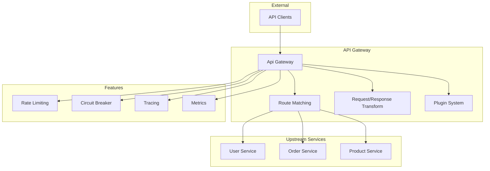

# Faultless Framework Architecture - v9.0.0 (2023)

## Overview

This document describes the architecture of Faultless v9.0.0, focusing on API Gateway, inspired by modern microservice architecture's gateway.

## Version Timeline

| Version | Year | Focus |
|---------|------|-------|
| v1.0.0 | 2015 | Core HTTP Server |
| v2.0.0 | 2016 | Config + Logging Enhancements |
| v3.0.0 | 2017 | Middleware + Error Handling |
| v4.0.0 | 2018 | Service Discovery + Load Balancing |
| v5.0.0 | 2019 | Advanced Resilience Patterns |
| v6.0.0 | 2020 | RPC Framework + Protobuf |
| v7.0.0 | 2021 | Caching + Database Integration |
| v8.0.0 | 2022 | Distributed Tracing + Metrics |
| **v9.0.0** | **2023** | **API Gateway** |
| v10.0.0 | 2024 | Code Generation CLI |
| v11.0.0 | 2025 | Microservice Governance |
| v12.0.0 | 2026 | Full Feature Parity |

## v9.0.0 Architecture



## New Features in v9.0.0

### API Gateway (`gateway.ts`)

```typescript
const gateway = createApiGateway();

// Add routes
gateway.addRoute({
  id: 'users-list',
  name: 'List Users',
  match: {
    type: RouteMatchType.EXACT,
    path: '/api/users',
    methods: ['GET'],
  },
  upstream: {
    name: 'user-service',
    target: 'http://localhost:3001',
    loadBalancer: 'p2c',
  },
  rateLimit: { max: 100, windowMs: 60000 },
  timeout: 5000,
  retries: 3,
});

// Match route
const route = gateway.matchRoute('GET', '/api/users');

// Execute plugins
await gateway.executePlugins('onRequest', request, reply);
```

**Route Match Types:**
| Type | Description | Example |
|------|-------------|---------|
| EXACT | Exact path match | `/api/users` |
| PREFIX | Path prefix match | `/api/users/` |
| REGEX | Regex pattern match | `^/api/products/\d+$` |

### Request/Response Transformation

```typescript
gateway.addRoute({
  id: 'transform-route',
  match: { type: RouteMatchType.PREFIX, path: '/api/v1' },
  upstream: { name: 'api-service', target: 'http://localhost:3001' },
  transforms: {
    request: [
      { type: 'add-header', name: 'X-Gateway', value: 'Faultless' },
      { type: 'remove-header', name: 'Authorization' },
      { type: 'rewrite-path', pattern: '^/api/v1', replacement: '/api' },
      { type: 'add-query', name: 'version', value: '1' },
    ],
    response: [
      { type: 'add-header', name: 'X-Gateway-Response', value: 'true' },
      { type: 'remove-body-field', path: 'internal.id' },
    ],
  },
});
```

**Transform Types:**
| Request Transform | Description |
|-------------------|-------------|
| add-header | Add header to request |
| remove-header | Remove header from request |
| set-header | Set header value |
| rewrite-path | Rewrite request path |
| add-query | Add query parameter |
| remove-query | Remove query parameter |

| Response Transform | Description |
|--------------------|-------------|
| add-header | Add header to response |
| remove-header | Remove header from response |
| set-header | Set header value |
| remove-body-field | Remove field from response body |
| add-body-field | Add field to response body |

### Plugin System

```typescript
const loggingPlugin: GatewayPlugin = {
  name: 'logging',
  enabled: true,
  onRequest: async (request, reply) => {
    console.log(`Request: ${request.method} ${request.url}`);
  },
  onResponse: async (request, reply, response) => {
    console.log(`Response: ${response.statusCode} in ${response.duration}ms`);
  },
};

gateway.registerPlugin(loggingPlugin);
```

### Gateway Middleware

```typescript
// Apply gateway middleware to Fastify
fastify.addHook('preHandler', createGatewayMiddleware(gateway));
fastify.addHook('preHandler', createResponseTransformerMiddleware(gateway));
```

## Package Structure

### @Faultless/gateway v9.0.0

| Module | Description |
|--------|-------------|
| `gateway.ts` | API Gateway core with routing, transformation, plugins |

## Configuration Schema

```json
{
  "gateway": {
    "routes": [
      {
        "id": "users-list",
        "name": "List Users",
        "match": {
          "type": "EXACT",
          "path": "/api/users",
          "methods": ["GET"]
        },
        "upstream": {
          "name": "user-service",
          "target": "http://localhost:3001"
        },
        "rateLimit": {
          "max": 100,
          "windowMs": 60000
        },
        "timeout": 5000,
        "retries": 3
      }
    ],
    "plugins": [
      {
        "name": "logging",
        "enabled": true
      }
    ]
  }
}
```

## Running the Example

```bash
cd examples/v9-gateway
pnpm install
pnpm dev
```

Test endpoints:
- `GET /gateway/stats` - Get gateway statistics
- `GET /gateway/routes` - List all routes
- `POST /gateway/routes` - Add new route
- `POST /gateway/routes/:id/remove` - Remove route

## Testing

```bash
pnpm test
```

## Design Decisions

1. **Flexible Route Matching** - Exact, prefix, and regex support
2. **Plugin Architecture** - Extensible via hooks
3. **Request/Response Transformation** - Header, path, query, body manipulation
4. **Rate Limiting per Route** - Fine-grained control
5. **Integration with Previous Features** - Circuit breaker, tracing, metrics

## Integration with Previous Versions

```typescript
// Full stack with gateway
const app = createApplication({
  modules: [AppModule],
  serverOptions: {
    port: 3000,
    middleware: [
      createTracingMiddleware(tracing),
      createMetricsMiddleware(metrics),
      createGatewayMiddleware(gateway),
      createResponseTransformerMiddleware(gateway),
    ],
  },
});
```

## Next Steps (v10.0.0)

- Code Generation CLI (goctl equivalent)
- Project scaffolding
- API definition generation
- Model generation